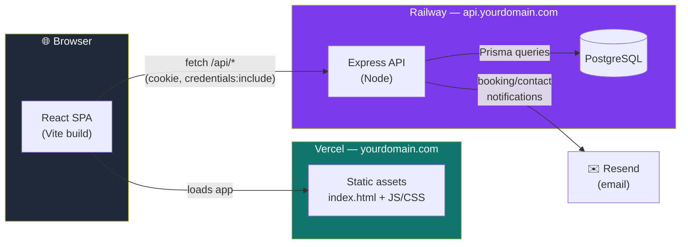
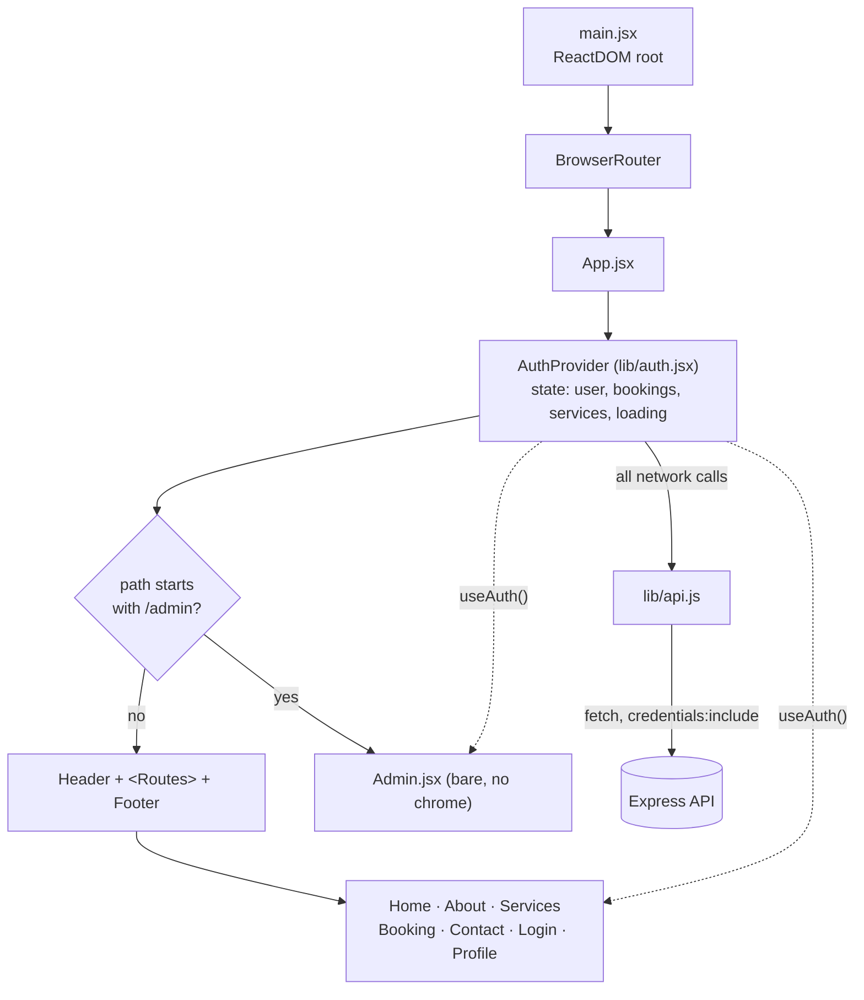
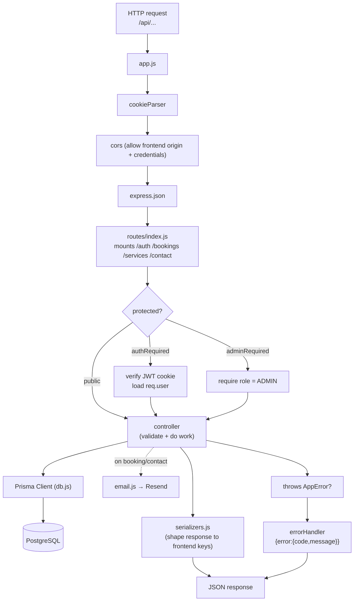
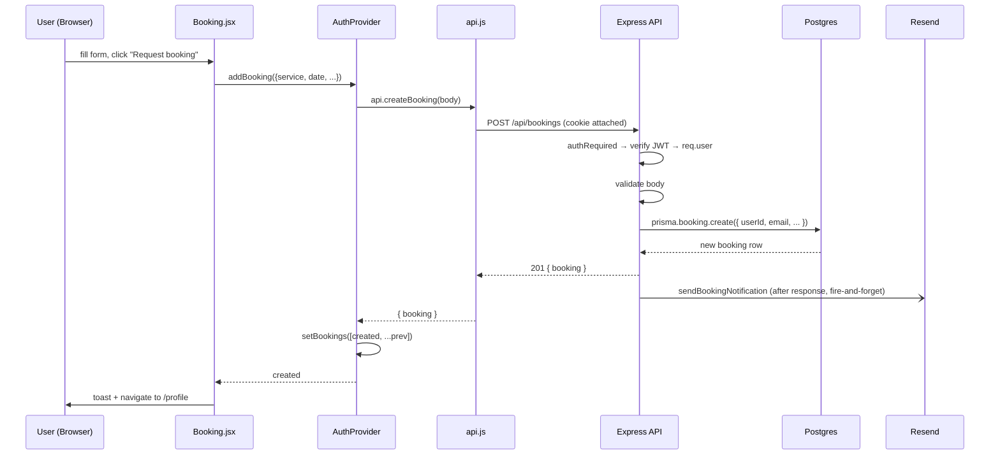
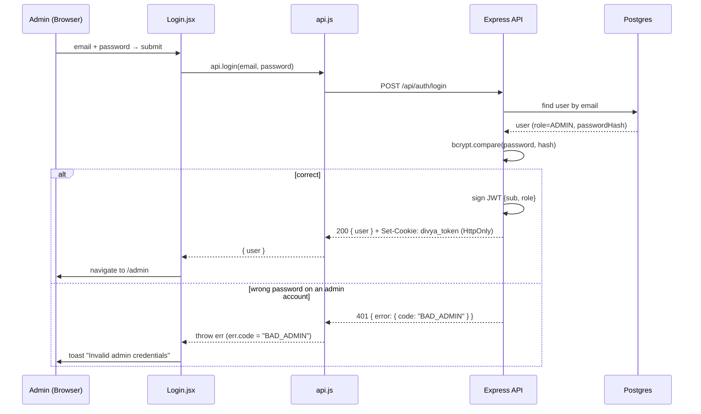
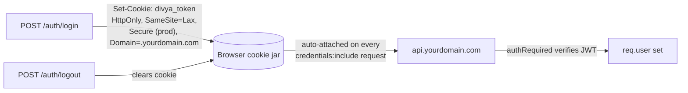
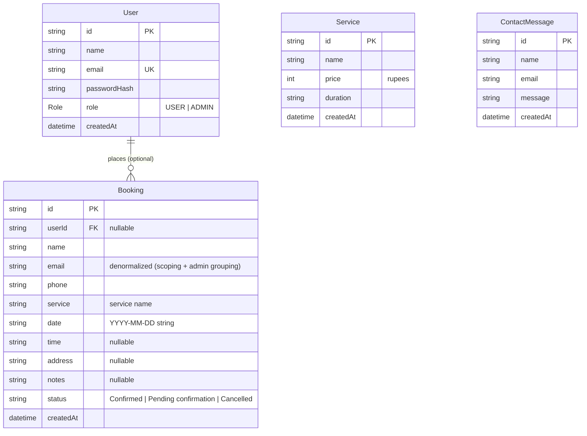

# Divya Seva — Architecture

A full-stack walkthrough of the Divya Seva booking platform: how the pieces fit
together, what every file does, and how a request travels from a click in the
browser all the way to Postgres and back.

> **TL;DR** — A React (Vite) single-page app talks over HTTPS to an Express +
> Prisma API, which persists to PostgreSQL and sends notification emails via
> Resend. Auth is a JWT in an httpOnly cookie; the admin role is enforced on the
> server. Frontend deploys to Vercel, backend + DB to Railway.

---

## 1. System overview

Two independently deployed apps in one repo (a monorepo). The frontend is static
files served from a CDN; the backend is a stateless Node process in front of a
managed Postgres.



**Why this split?**

- The frontend is pure static output (`vite build` → `dist/`), so a CDN host like
  Vercel serves it cheaply and fast with zero server code.
- The backend is the only thing that touches secrets (DB, JWT signing key, email
  key) and enforces authorization. Keeping it separate means the browser never
  sees anything privileged.
- Both live under one root domain (`yourdomain.com` + `api.yourdomain.com`) so the
  auth cookie can be shared between them cleanly.

---

## 2. Repository layout

```
divya-vite-react_new/            # repo root = FRONTEND (deploys to Vercel)
├── index.html                   # SPA entry HTML (Vite injects the bundle)
├── vite.config.js               # Vite config: React plugin, @ alias, dev port
├── tailwind.config.js           # Tailwind content globs
├── postcss.config.js            # PostCSS (tailwind + autoprefixer)
├── jsconfig.json                # editor path alias @ -> src
├── .env.local                   # VITE_API_URL (gitignored)
├── .env.example                 # template for the above
├── src/
│   ├── main.jsx                 # ReactDOM root + <BrowserRouter>
│   ├── App.jsx                  # routes + layout shells + <AuthProvider>
│   ├── styles.css               # Tailwind + design tokens (OKLCH, themes)
│   ├── lib/
│   │   ├── api.js               # ★ fetch wrapper — the ONLY thing that calls the API
│   │   ├── auth.jsx             # ★ AuthProvider context (async, API-backed)
│   │   ├── i18n.js              # EN/HI/TA/MR translations (react-i18next)
│   │   └── theme.js             # light/dark/sepia theme hook
│   ├── components/site/         # Header, Footer, LanguageSwitcher, ThemeSwitcher, Reveal
│   └── pages/                   # Home, About, Services, Booking, Contact, Login, Profile, Admin
│
└── server/                      # BACKEND (deploys to Railway)
    ├── package.json             # scripts + deps (own package.json)
    ├── docker-compose.yml       # local Postgres (host port 5544)
    ├── .env / .env.example      # DB URL, JWT secret, admin, email, CORS
    ├── prisma/
    │   ├── schema.prisma        # ★ DB schema (source of truth)
    │   ├── migrations/          # generated SQL migrations
    │   └── seed.js              # admin + 5 services + 10 sample bookings
    ├── test/
    │   └── api.test.js          # supertest integration tests
    └── src/
        ├── index.js             # entry: start HTTP server
        ├── app.js               # ★ express app: middleware + route mounting
        ├── config/env.js        # validated env vars
        ├── db.js                # PrismaClient singleton
        ├── lib/                 # errors, serializers, password, jwt, cookies, email
        ├── middleware/          # authRequired, adminRequired, errorHandler
        ├── controllers/         # request handlers (auth, bookings, services, contact)
        └── routes/              # URL → middleware → controller wiring
```

★ = the files that carry the most architectural weight.

---

## 3. Frontend architecture

### Component & data tree

Everything renders inside a single `AuthProvider` that owns the app's shared
state. Routing picks one of two "shells" based on the URL.



### How state flows

- **`AuthProvider`** is the single source of truth. On mount it hydrates: calls
  `GET /auth/me` (am I logged in?) and `GET /services` in parallel, then
  `GET /bookings` if a user is present. Until that resolves, `loading` is `true`.
- Pages read state and actions via **`useAuth()`** — e.g. `Profile` reads
  `bookings`, `Admin` reads `allBookings` + calls `updateBooking`, `Booking` reads
  `services` + calls `addBooking`.
- Every action method (`login`, `addBooking`, `updateBooking`, …) is an **async
  wrapper** that calls `lib/api.js`, then updates React state from the response.
  Components never call `fetch` or `api.js` directly for shared data (except
  `Contact`, which posts a one-off message).

### Frontend file reference

| File | Responsibility |
|---|---|
| `src/main.jsx` | Mounts React, wraps the app in `<BrowserRouter>`, imports global styles + i18n. |
| `src/App.jsx` | Declares routes; chooses the admin-vs-site shell by pathname; mounts `<AuthProvider>` and the toast `<Toaster>`. |
| `src/lib/api.js` | Thin `fetch` wrapper. Adds `credentials:"include"` (sends the cookie), prefixes `VITE_API_URL`, parses JSON, and throws an `Error` whose `.code` is the server's error code. **The only module that knows the API exists.** |
| `src/lib/auth.jsx` | `AuthProvider` context. Holds `user/bookings/services/loading`; exposes `login, signup, logout, addBooking, updateBooking, deleteBooking, addService, removeService`. All async, all backed by `api.js`. |
| `src/lib/i18n.js` | All EN/HI/TA/MR strings in one `resources` object; language persisted to localStorage. Use `t("key")`. |
| `src/lib/theme.js` | `useTheme()` — cycles light/dark/sepia by toggling `<html>` classes; persisted to localStorage. |
| `src/components/site/Header.jsx` | Top nav, auth-aware (shows profile/logout or sign-in), language + theme switchers, WhatsApp link. |
| `src/components/site/Footer.jsx` | Footer links + tagline (i18n). |
| `src/components/site/Reveal.jsx` | Scroll-reveal animation wrapper (framer-motion). |
| `src/pages/Home/About/Services.jsx` | Marketing pages. `Services` can list services. |
| `src/pages/Booking.jsx` | Booking form. Pulls `services` from context; requires sign-in; calls `addBooking`. |
| `src/pages/Contact.jsx` | Contact form. Posts directly via `api.contact()`. |
| `src/pages/Login.jsx` | Login/signup form. Calls `login`/`signup`; branches on `err.code` (`BAD_ADMIN`, `RESERVED_EMAIL`). |
| `src/pages/Profile.jsx` | Logged-in user's bookings + stats. Guards on `loading` then redirects if signed out. |
| `src/pages/Admin.jsx` | Admin dashboard (bookings, devotees, services). Its own inline-styled design system (no Tailwind). Calls `updateBooking`/`deleteBooking`/`addService`/`removeService`. |

---

## 4. Backend architecture

The backend is a classic layered Express app: **routes → middleware →
controllers → Prisma → Postgres**. Each layer has one job.



### Backend file reference

| File | Responsibility |
|---|---|
| `src/index.js` | Boots the HTTP server (reads `PORT`, calls `app.listen`). Nothing else. |
| `src/app.js` | Builds the Express app: `cookieParser` → `cors` → `express.json` → `/api` routes → 404 → `errorHandler`. |
| `src/config/env.js` | Reads & **validates** env vars at startup (throws if `DATABASE_URL`/`JWT_SECRET` missing). Exposes a typed `env` object. |
| `src/db.js` | Single shared `PrismaClient` (reused across hot reloads to avoid connection exhaustion). |
| `src/lib/errors.js` | `AppError(code, message, status)` + `asyncHandler` (so thrown errors reach the error middleware without try/catch everywhere). |
| `src/lib/serializers.js` | Converts DB rows → the exact JSON keys the frontend expects (`role` lowercased, `createdAt`→ISO, etc.). Keeps the API/UI contract in one place. |
| `src/lib/password.js` | `hashPassword` / `verifyPassword` (bcrypt, cost 12). |
| `src/lib/jwt.js` | `signToken` / `verifyToken` (7-day JWT signed with `JWT_SECRET`). |
| `src/lib/cookies.js` | Cookie name + options. Dev = host-only, not Secure; prod = `Secure`, `SameSite=Lax`, `Domain=.yourdomain.com`. |
| `src/lib/email.js` | `sendBookingNotification` / `sendContactNotification` via Resend. No-ops (logs) if no API key; **never throws** (email failure can't break a booking). |
| `src/middleware/authRequired.js` | Verifies the JWT cookie, loads the user, sets `req.user = {id,email,role,name}`. 401 if missing/invalid. |
| `src/middleware/adminRequired.js` | Runs after `authRequired`; 403 unless `req.user.role === "ADMIN"`. **This is the admin gate.** |
| `src/middleware/errorHandler.js` | Turns any error into `{error:{code,message}}` with the right HTTP status. |
| `src/controllers/auth.controller.js` | `signup`, `login`, `logout`, `me`. Hashing, cookie issuance, reserved-email + `BAD_ADMIN` semantics. |
| `src/controllers/bookings.controller.js` | `list` (own-or-all by role), `create` (+ email), `update` (status), `delete`. Status allowlist. |
| `src/controllers/services.controller.js` | `list` (public), `add`, `remove`. Price/name validation. |
| `src/controllers/contact.controller.js` | `create` — persists a message and emails the admin. |
| `src/routes/*.routes.js` | Map `METHOD /path` → the middleware chain → controller. Thin. |
| `src/routes/index.js` | Mounts all sub-routers under `/api` + a `/health` check. |
| `prisma/schema.prisma` | The database schema — source of truth for tables + the generated client. |
| `prisma/seed.js` | Idempotent seed: upserts the admin, and seeds 5 services + 10 sample bookings if empty. |
| `test/api.test.js` | Integration tests for the security-critical flows (auth, scoping, admin gate). |

---

## 5. Request lifecycle — two worked examples

### Example A: a user submits a booking



Key points: the server derives `email`/`userId` from the signed-in session (the
client can't spoof them), and the notification email is sent **after** the
response so a slow/broken mailbox never delays or fails the booking.

### Example B: admin login (and why it's secure now)



The admin password now lives only as a **bcrypt hash in the database**. The
browser never receives it, and the admin role is checked on the server for every
`/admin`-scoped API call via `adminRequired`. (Previously the password was
hard-coded in client JavaScript — anyone could read it.)

---

## 6. Authentication & the cookie



- **httpOnly** → JavaScript can't read the token, so an XSS bug can't steal the
  session.
- **Shared parent domain** (`.yourdomain.com`) → the cookie set by
  `api.yourdomain.com` is sent along when the frontend at `yourdomain.com` calls
  the API. `SameSite=Lax` is safe here because both are first-party.
- **Local dev** → frontend `localhost:5173` ↔ API `localhost:4000`. CORS is
  configured with the exact origin + `credentials: true`, and the cookie is a
  host-only, non-Secure `localhost` cookie.

---

## 7. Data model



Design notes:

- **`Booking.userId` is nullable** so seeded sample bookings (no account) exist,
  and deleting a user doesn't wipe their booking history.
- **`Booking.email` is denormalized** because the app scopes a user's bookings by
  email and the admin groups "devotees" by email — matching the original data.
- **`status` and `date` are stored as strings** in the exact format the frontend
  already renders, so the UI needed no changes to its display logic.

---

## 8. Environments & configuration

| Concern | Local dev | Production |
|---|---|---|
| Frontend | `npm run dev` → `localhost:5173` | Vercel → `yourdomain.com` |
| API | `cd server && npm run dev` → `localhost:4000` | Railway → `api.yourdomain.com` |
| DB | Docker Postgres (`npm run db:up`, port 5544) | Railway Postgres plugin |
| `VITE_API_URL` | `http://localhost:4000` | `https://api.yourdomain.com` |
| Cookie | host-only, not Secure | `Secure`, `Domain=.yourdomain.com` |
| Email | logged to console (no key) | Resend (verified domain) |
| Admin gate | server-enforced (same code) | server-enforced |

Secrets live only in `.env` files (gitignored) or the host's env settings —
`DATABASE_URL`, `JWT_SECRET`, `ADMIN_PASSWORD`, `RESEND_API_KEY`. The frontend only
ever knows `VITE_API_URL`.

See `server/README.md` for the step-by-step Railway + Vercel + DNS deploy guide.

---

## 9. Where to make common changes

| I want to… | Touch these |
|---|---|
| Add a field to bookings | `prisma/schema.prisma` (+ migrate) → `serializers.js` → `bookings.controller.js` → the relevant page |
| Add an API endpoint | new `controllers/*.js` fn → wire in `routes/*.routes.js` → add a method to `src/lib/api.js` |
| Change who can do what | `middleware/authRequired.js` / `adminRequired.js` + the route's middleware chain |
| Change the notification email | `src/lib/email.js` |
| Change UI copy | `src/lib/i18n.js` (all four languages) |
| Change colors/themes | `src/styles.css` |
| Add a new admin action | `Admin.jsx` → context method in `auth.jsx` → `api.js` → controller/route |
```
